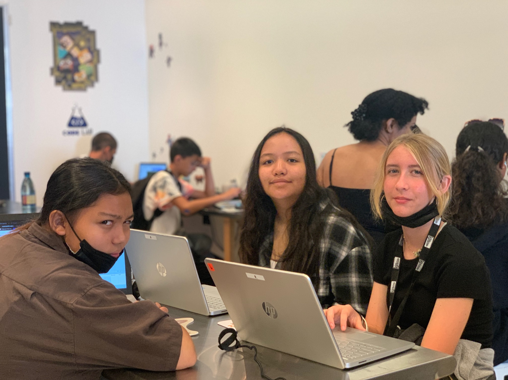

     
Teaching the next generation of students is such an important part in allowing these kids to figure out what their passions and interests are. Without a proper education, kids growing up will not have the opportunities to find what these passions may be. I had the immense pleasure of teaching two groups of middle-high schoolers from neighboring islands about computer science.

Over the course of a month, we taught these kids various programming languages, how to build their own websites, building their own keyboards/computers, and other various projects.

Through this experience, not only did I reinforce my own knowledge of computer science through teaching it, but I also learned what being a teacher really means. Being surrounded by many talented and driven teachers who have been doing this for generations really opened my eyes to how hard and important it is to be a good teacher to your students. Now with this experience, I have so much more respect for all teachers around the world

