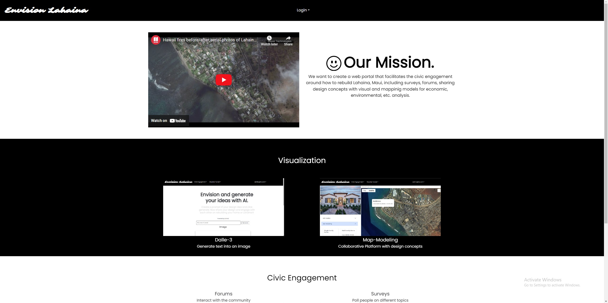

     
For our ICS 314 project, my group and I created a website called "Envision Lahaina." Our mission is that We want to create a web portal that facilitates the civic engagement around how to rebuild Lahaina, Maui, including surveys, forums, sharing design concepts with visual and mappinig models for economic, environmental, etc. analysis. Our website keeps up to date with all the current events happening with Lahaina and allows much more interaction and input directly from the community. 

Although this is not my first time collaborating on a software engineering project, this project was much different because it revolved around Meteor. Before this class I have never worked with Meteor before and I was quick to realize that it was not easy. Working with Meteor was completely different than anything I've worked with and lots of my time was spent tracing Meteor and how all the code communicates with one another. I also was able to work with React a lot more as well. I have worked with React before, but not Meteor React, so I was able to expand my knowledge on React as well as learn about Meteor

Despite the difficulties I faced, I was able to contribute a lot to the back end of the code that I can genuinely say I am proud of. Here is a brief list of my contributions:
- Created a delete button on the survey page to allow users to delete ONLY their own surveys
- Any survey or forum post will automatically delete itself if it is older than a month old
- Limit the amount of surveys a user can create to one per day to prevent spam
- Limit the amount of forum posts a user can create to three per day

Github Project Page: https://github.com/envision-lahaina

