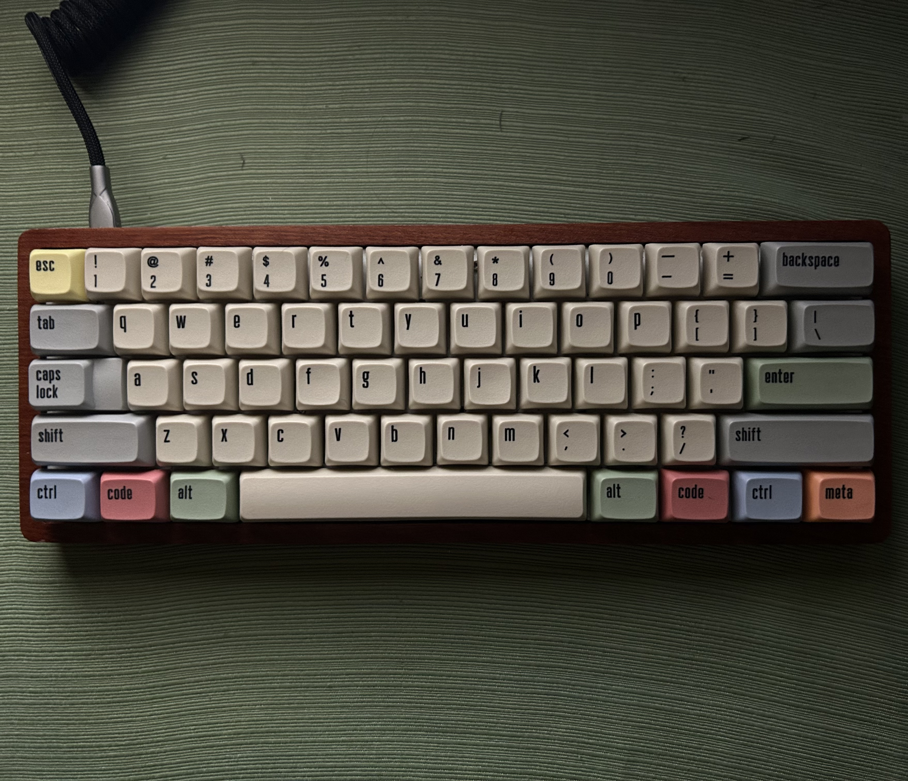

     
One of the biggest hobbies that I acquired for myself over quarantine was building my own custom keyboard. Back then, the custom keyboard scene was no where near as big as it is now with many parts taking years to even arrive without even knowing if it is compatible with your keyboard or not. However, I was always fascinated with taking such a practical object, like a keyboard, and making it into your own

After doing much more research on customizing your keyboard, I learned that there are so many aspects of the keyboard that you can customize. Here are the basic componenents of a keyboard:
- Keycaps: The cover for each key
- Switches: Each key underneath the keycap has a key switch that actuates the key press when you press a key
- Plate: A customizable plate that holds all the key switches of your keyboard
- PCB: What transfers the signal of a key press from the keyboard to the computer (goes under the plate)
- Case: What holds all of these components together to form your customized keyboard

Every single one of these components are heavily customizable. Moreover, you can add extra things such as PCB foam, frankenswitches, and different additions to your case. I spent a lot of time finding the keyboard that's right for me and I'm very happy with how it turned out
